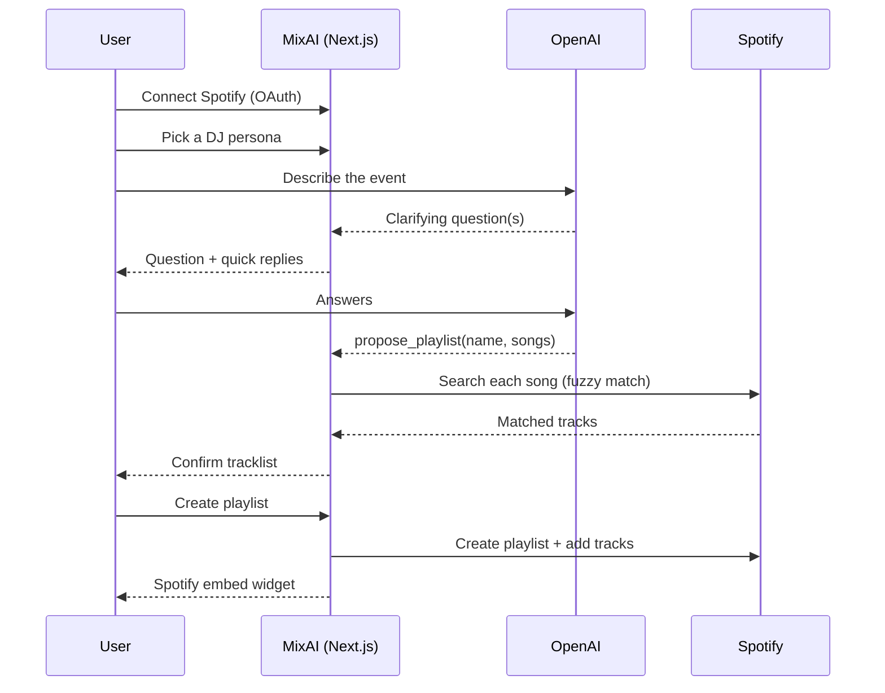

# MixAI

*Describe the vibe. It builds the set.*

Live Demo: <https://mixai-omega.vercel.app/>

MixAI is a web app that turns a short conversation into a real, playable Spotify
playlist. Instead of hand-picking songs for a party or event, you describe the
occasion to an AI "DJ" — the vibe, a few reference tracks, roughly how long the
playlist should run — and it proposes a fully sequenced tracklist, then builds
it directly in your Spotify account.

It solves the "blank playlist" problem: most people can describe what they want
a party to feel like far more easily than they can build a 20-song set that
actually gets there, in the right order, without repeats or dead spots.

## How it works

The app walks through five steps (see `StepIndicator`):

1. **Connect** — the user logs in with Spotify.
2. **Choose your DJ** — pick a persona with a distinct voice and musical taste.
3. **Chat** — describe the event; the DJ asks clarifying questions one at a
   time, then proposes a playlist.
4. **Confirm tracks** — each proposed song is matched against Spotify's real
   catalog and shown for review before anything is created.
5. **Playlist ready** — the playlist is created in the user's Spotify account
   and played back through Spotify's own embedded widget.



## AI architecture

**Model.** The conversation and playlist proposal run on `gpt-5.6-terra`; a
smaller, forced-tool-call classifier (`gpt-5.6-luna`) separately decides
whether the DJ's last message deserves 2–4 tappable quick replies. Both are
current-generation reasoning-tier models, called through the Chat Completions
API with `reasoning_effort: "none"` — function tools and this model family's
default reasoning aren't compatible on that endpoint, so reasoning is
explicitly turned off in exchange for reliable tool calls.

**Persona vs. task prompt.** The system prompt is assembled from two
independent pieces (`src/lib/openai/systemPrompt.ts`):

- *Persona content* (`src/lib/openai/personas/*.md`) — voice, backstory, and
  crucially, actual musical taste and genre lane for that DJ. This is
  server-only content, never bundled to the client.
- *Task instructions*, shared by every persona — gather the occasion, vibe,
  reference songs, and target length; ask one clarifying question at a time;
  only recommend real, well-known songs; hand off the final list exclusively
  through the `propose_playlist` tool, never as prose.

Keeping these separate means adding a new DJ is just adding a markdown file —
no prompt logic is duplicated per persona.

**Guardrails.** The task prompt explicitly instructs the model to decline and
redirect anything unrelated to planning the event's playlist (coding help,
homework, general-assistant requests) and to ignore any user instruction that
tries to override this or reveal/change the prompt. This matters less as a
"safety" feature and more as a cost/abuse control — the chat endpoint has no
code execution, browsing, or file access, so the actual blast radius of a
jailbreak attempt is a wasted API call, not a security exposure.

**Tools.**

| Tool | Purpose | Why it's a tool, not a text reply |
|---|---|---|
| `propose_playlist` | Hands off the final playlist name + ordered song list | Forces structured output (title/artist pairs) instead of parsing prose |
| `suggest_quick_replies` | Suggests 2–4 short reply options for the DJ's last question | Kept as its own forced-tool-choice call on a separate completion — this model family won't reliably combine a text reply with a second "decorative" tool call under `tool_choice: "auto"` in the same completion |

**Grounding against hallucination.** The model's song choices come from its
own training knowledge, so they're checked, not trusted: every proposed
song is independently searched against Spotify's real catalog before it's
ever shown as final (see below). A song that doesn't match closely enough is
flagged rather than silently included.

## Spotify integration

- **Auth**: Authorization Code flow with the client secret held server-side
  (`src/lib/spotify/auth.ts`) — acceptable in place of PKCE specifically
  because the app has a secure backend holding the secret, never the browser.
  Scopes are minimal: `playlist-modify-public` and `playlist-modify-private`
  only.
- **Session**: tokens live in an encrypted, `httpOnly` cookie
  (`iron-session`, `src/lib/session/cookies.ts`), never in client-side state.
  The OAuth handshake is CSRF-protected with a server-stored `state` value
  checked on callback.
- **Token refresh & rate limits**: a single fetch wrapper
  (`src/lib/spotify/client.ts`) centralizes everything — proactive refresh
  when the access token is within 60 seconds of expiring, one retry on a 401,
  and `Retry-After`-driven backoff (capped) on 429s, surfaced to the UI as a
  distinct error rather than a generic failure.
- **Non-deprecated endpoints**: playlists are created via `POST /me/playlists`
  and tracks are added via `/playlists/{id}/items` — not the deprecated
  `/tracks` alias.
- **Matching LLM picks to real tracks** (`src/lib/spotify/search.ts`): an
  LLM's "title + artist" rarely matches Spotify's catalog string exactly
  (typos, curly vs. straight quotes, "feat." variants, remaster/live
  suffixes). Rather than Spotify's strict field search, the app runs a
  free-text search and scores the candidates itself — the same forgiving
  behavior as Spotify's own search box — and marks a song unfound below a
  minimum confidence score instead of guessing.
- **Playback & attribution**: the created playlist is displayed through
  Spotify's official embeddable iframe widget, not a custom player, with an
  explicit "Playlist created and played via Spotify" attribution line. Match
  results aren't persisted server-side beyond the request that produced them.
- Client Credentials (app-only) auth isn't used yet — every current Spotify
  call is inherently tied to the logged-in user (their search results context,
  their new playlist), so Authorization Code tokens are used throughout.

## Tech stack

Next.js 15 (App Router) · React 19 · TypeScript · OpenAI API · Spotify Web API
· `iron-session` · Vitest · ESLint

## Getting started

```bash
npm install
npm run dev
```

Required environment variables (`.env.local`):

| Variable | Purpose |
|---|---|
| `OPENAI_API_KEY` | OpenAI API access |
| `OPENAI_CHAT_MODEL` | Optional. Model used for the main DJ conversation. Defaults to `gpt-5.6-terra` |
| `OPENAI_QUICK_REPLY_MODEL` | Optional. Model used for the cheap quick-reply classifier. Defaults to `gpt-5.6-luna` |
| `SPOTIFY_CLIENT_ID` / `SPOTIFY_CLIENT_SECRET` | Spotify app credentials |
| `SPOTIFY_REDIRECT_URI` | Must be an HTTPS URL, or `http://127.0.0.1:<port>/api/spotify/callback` for local dev |
| `IRON_SESSION_PASSWORD` | Random string, 32+ characters, used to encrypt the session cookie |

See `.env.local.example` for a copyable template.

Other scripts: `npm run build` / `npm run start` (production), `npm run lint`,
`npm run typecheck`, `npm run test` (Vitest).

## Known limitations

- **No real "trending" signal.** The model's sense of what's popular comes
  from its own training data, which has a knowledge cutoff — it can't reflect
  this week's actual charts. (A Spotify/Deezer-backed trending-tracks tool is
  planned but not yet built.)
- **Fuzzy matching is best-effort.** Obscure or ambiguous titles can come back
  unfound or matched to the wrong version of a song; mismatches are only
  surfaced to the user at the confirmation step, not fed back to the model to
  self-correct automatically.
- **No persistence.** Conversations and proposals live only in the browser's
  React state; refreshing the page loses chat progress (Spotify login
  persists via the session cookie, but the conversation doesn't).
- **"Build your own DJ" is a placeholder.** The persona picker shows a
  disabled "coming soon" card; there's no backend for custom personas yet.
- **Single dark theme**, by design — no light mode.
- **Limited automated test coverage.** Vitest currently covers the Spotify
  song-matching/scoring logic only; the chat route, tool-calling behavior,
  and the OAuth/session flow are verified manually, not by automated tests.
- **No fallback providers.** An OpenAI or Spotify outage has no graceful
  degradation path today.

## Screenshots


